# CustomVisionClient #
本工程使用Custiom Vision API构建，在PC端实现创建工程，创建Tag，新增图片，训练以及获取Iteration等功能

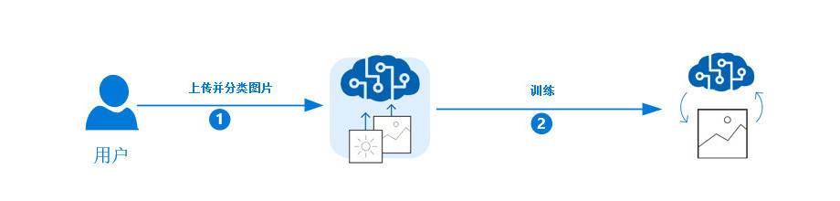  

### 使用流程 ###
本客户端的使用以名画识别作为示例

#### 1、进入*[Custom Vision Portal](https://www.customvision.ai)*，使用微软账户登录授权，至少创建一个空白工程，获取Training Key   ####
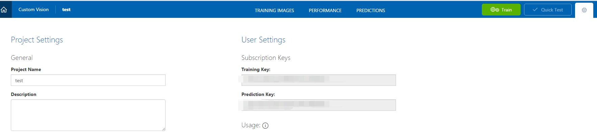  

####2、打开应用，填写Training Key，进入应用####
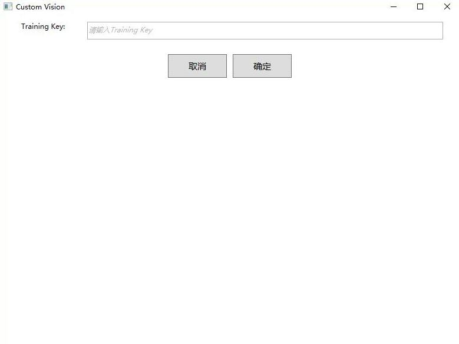  
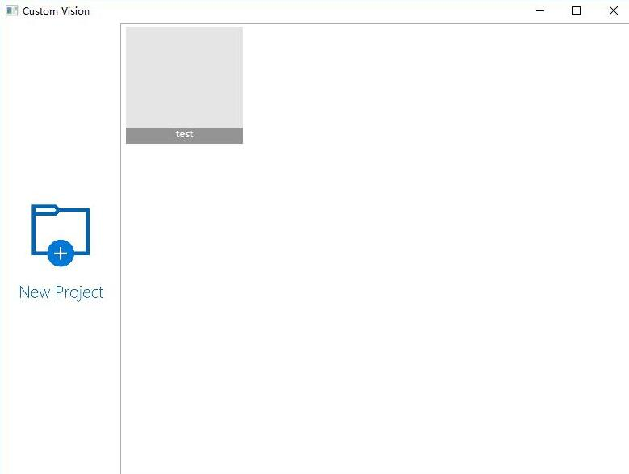  

#### 3、点击New Project新建工程，输入Project Name,Description,选择Domain   ####
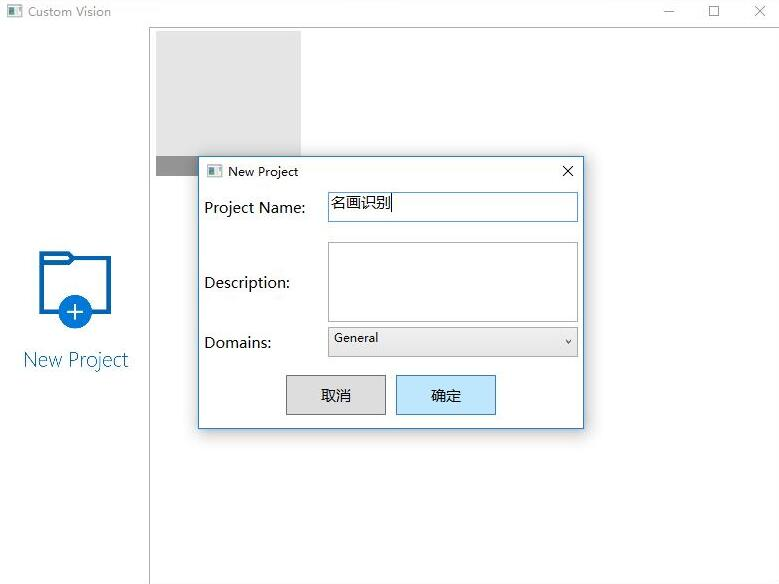  
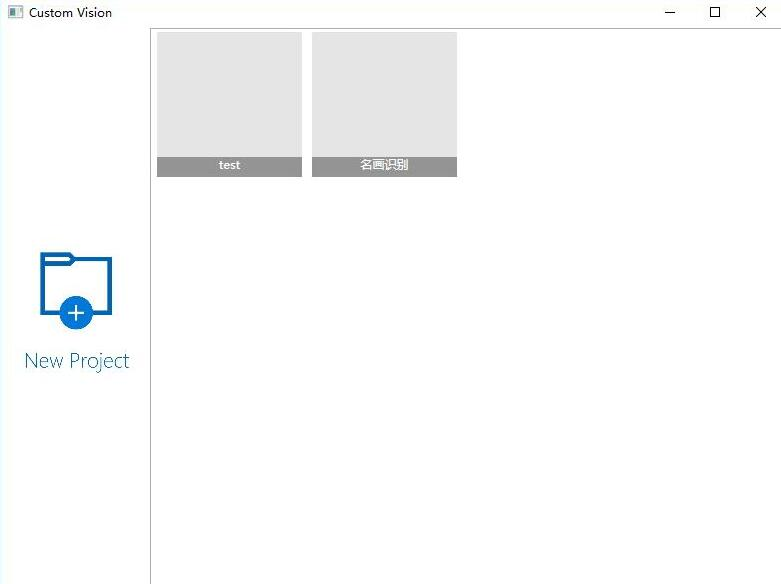  

#### 4、点击新创建的工程进入Project   ####
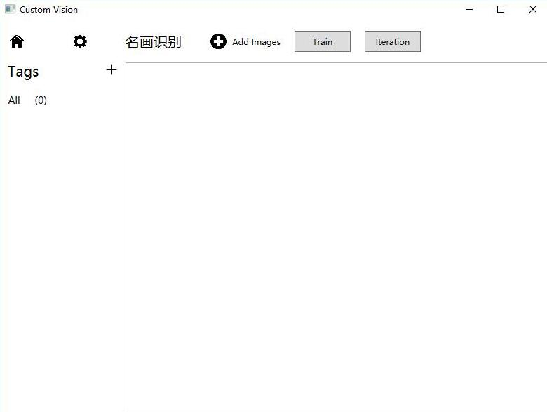  

#### 5、新建Tags   ####
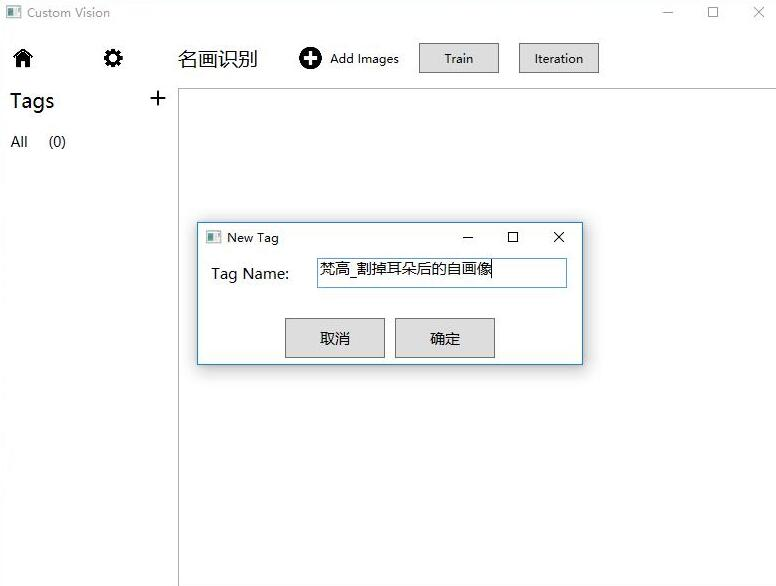  
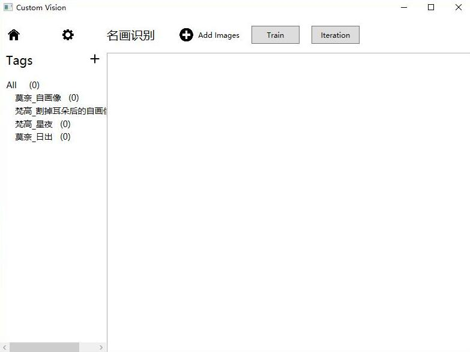  

#### 6、点击Add Images，添加图片   ####
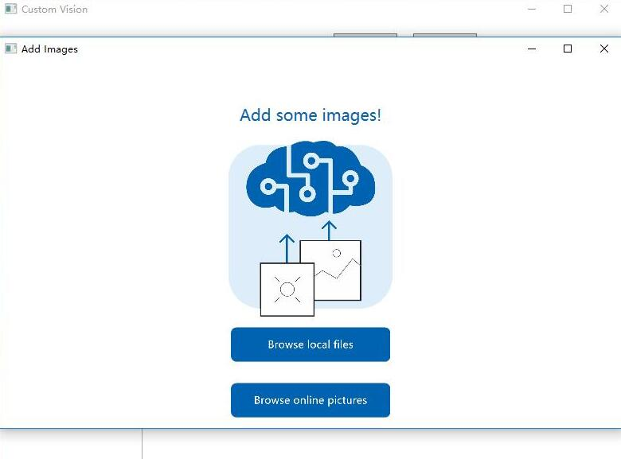  

#### 7、点击Browse local files添加本地图片   ####
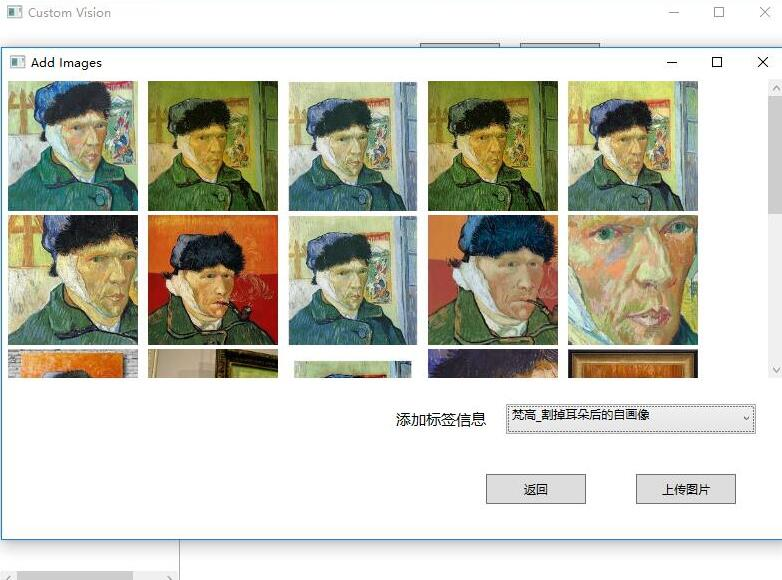  
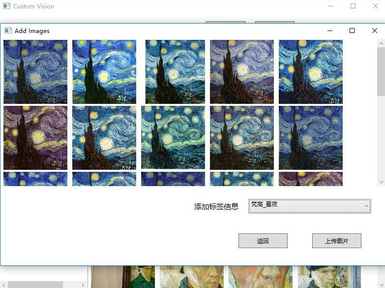  
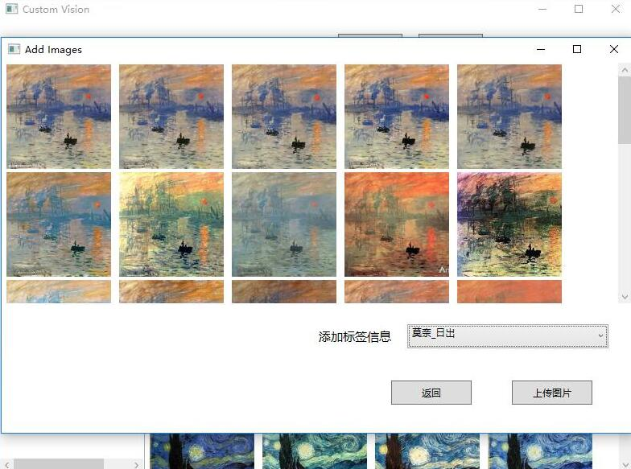  
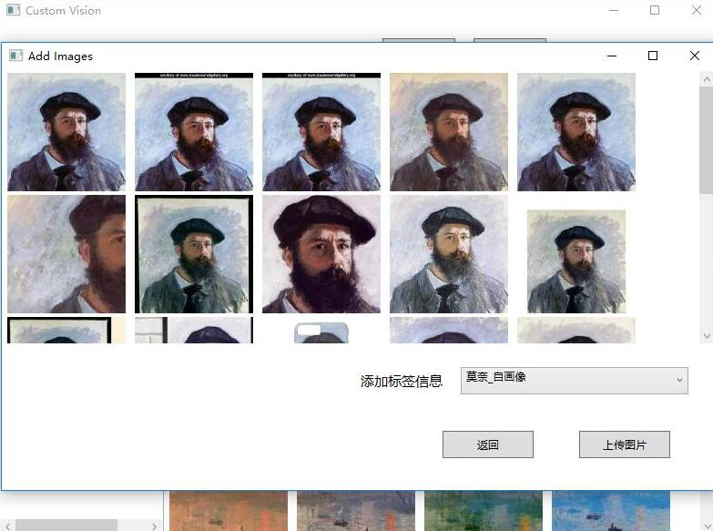  

#### 8、点击Browse online image添加网络图片（示例步骤，可选）   ####
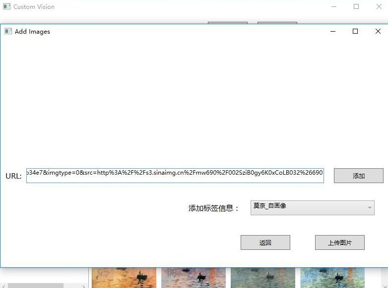  
  

#### 9、上传图片后如下图   ####
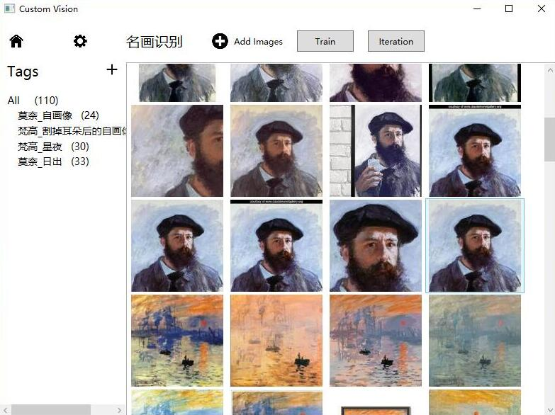  

#### 10、点击Train按钮进行训练   ####
*训练中*  
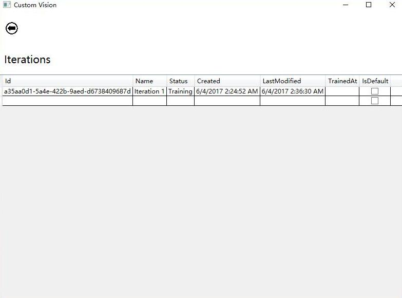  
*训练完成后*  
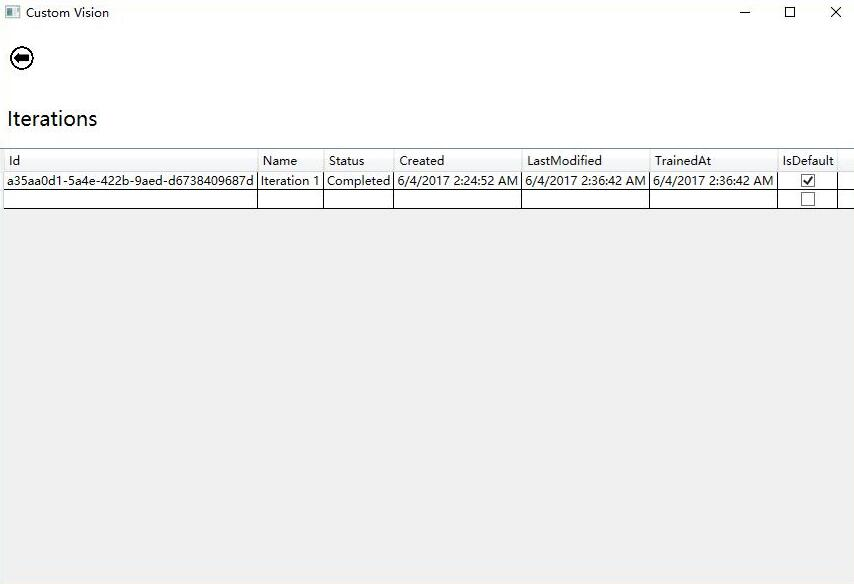 

#### 11、点击设置按钮，获取对应的预测识别用的Project Id和Prediction Key  ####
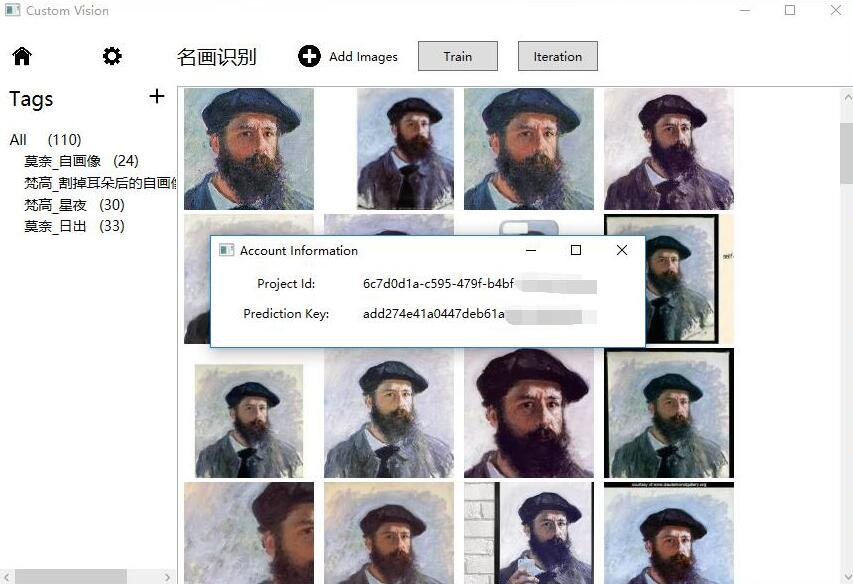 

### 参考 ###
[*CustomVision Quickstarts Overview*](https://docs.microsoft.com/zh-cn/azure/cognitive-services/custom-vision-service/getting-started-build-a-classifier)  
[*Cognitive-CustomVision-Windows*](https://github.com/Microsoft/Cognitive-CustomVision-Windows/)  
*[Custom Vision API](https://docs.microsoft.com/zh-cn/azure/cognitive-services/custom-vision-service/csharp-tutorial)*  
*[Custom Vision Portal](https://www.customvision.ai)*  
