# HoloCustomVision #
本Unity工程为Hololens客户端，实现使用HoloLens拍摄照片，调用Custom Vision API实现图片识别，并结合Bing Search实现相关图片搜索的功能  

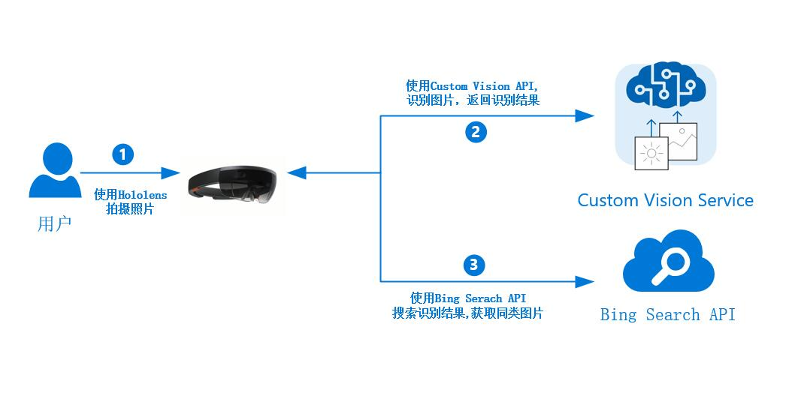  
### HoloToolkit-Unity说明 ###

本项目使用HoloToolkit-Unity实现凝视，点击功能，[HoloToolkit-Unity](https://github.com/Microsoft/HoloToolkit-Unity/tree/master/External/Unitypackages "HoloToolkit-Unity")版本为v1.5.6.0

### 软件说明 ###
*Unity*　　　　　版本 Unity 5.5.0f3  
*Visual Studio*　　版本 Visual Studio 2015 Update 3  

### 脚本说明 ###
*Button.cs*　　　　　　　　　自定义Button类，实现点击等功能  
*CanvasPanel.cs*　　　　　　实现Canvas跟随视线在一定高度移动  
*CapturePhotoManager.cs*  　  实现控制图片拍摄，图片识别，图片搜索流程  
*ConfigurationManager.cs*  　　实现配置信息的保存与获取    
*CropBoxManager.cs*  　　　　实现图片编辑功能，截取图片有效区域  
*CurrentMode.cs*  　　　　　　枚举类，当前使用模式  
*CurrentStatus.cs*  　　　　　　枚举类，当前状态  
*FaceCamera.cs*  　　　　　　实现使对象始终面向摄像机  
*GlobalListener.cs*　　　　　　全局监听，监听手进入Hololens视线及Air Tap事件   
*ImageCollectionManager.cs*　实现使用Bing Search API搜索显示图片列表  
*ModelManager.cs*　　　　　　模型管理类，控制Tip信息的显示隐藏，控制识别结果的显示隐藏，控制错误信息的显示隐藏等等  
*Prepare.cs*　　　　　　　　　实现倒数动画结束后，触发拍照识别流程  
*SettingControl.cs*　　　　　　控制配置信息的显示  
*Tool.cs*　　　　　　　　　　自定义Tool类  
*ToolManager.cs*　　　　　　自定义菜单管理类  
[*JSONObject.cs*](https://github.com/mtschoen/JSONObject/blob/master/JSONObject.cs "JSONObject.cs")　　　　　　 Unity中使用Json的开源代码

### 运行结果 ###
#### 1、启动HoloCustomVision，将视线对准需要识别的物体，使用Air Tap手势点击准备进行拍照 ####
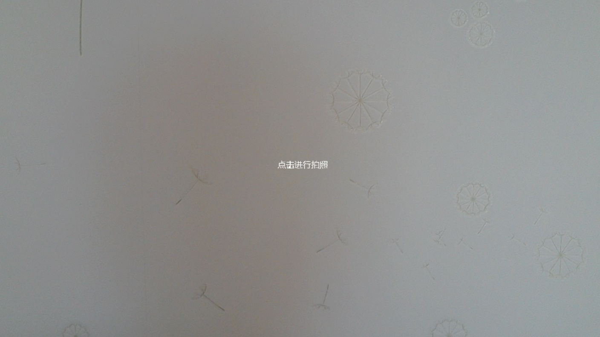  
#### 2、点击后倒数三秒钟，此时可以调整头部角度确保画作的大部分内容位于视野前方的可视范围内 ####
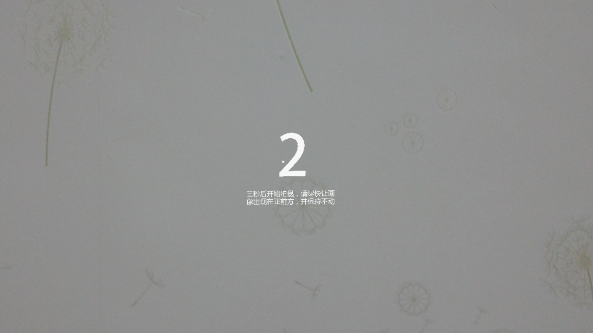  
#### 3、三秒后自动启动摄像头拍照，此时需保持头部不动，听到提示音后拍照完成显示照片 ####
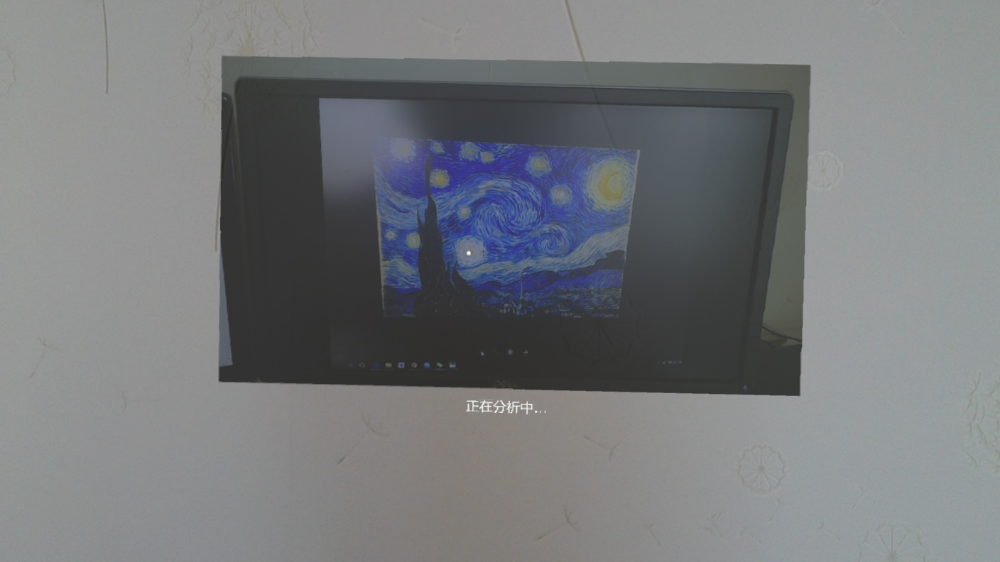  
#### 4、正在分析中，等待识别结果 ####
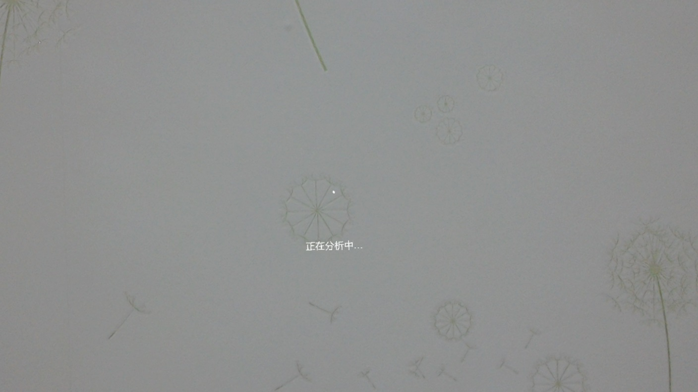  
#### 5、识别完成后显示画家、画作名称以及可能性，并开始搜索该画家的相关作品 ####
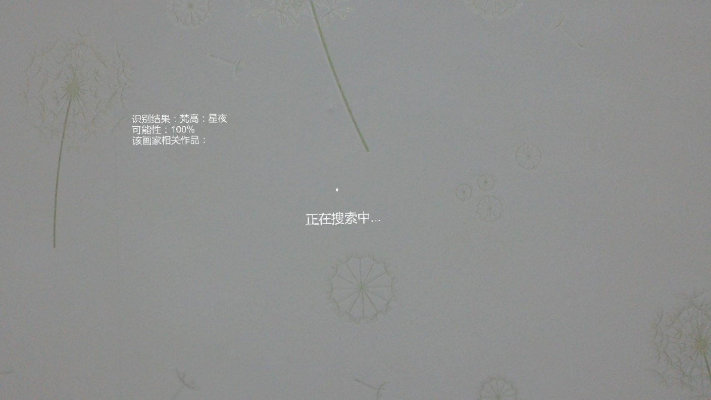  
#### 6、搜索成功后以弧面形式展示其他画作照片 ####
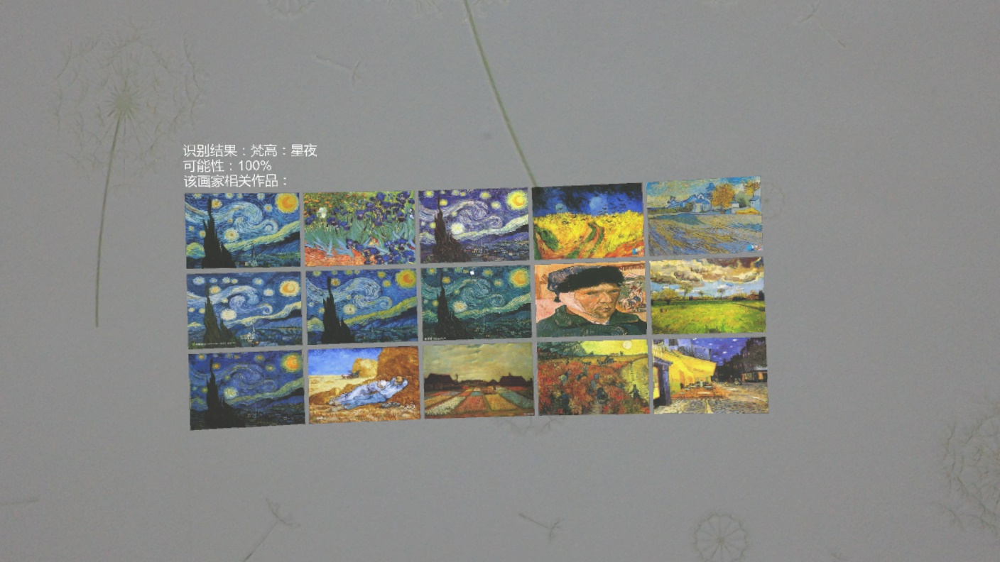  
#### 7、使用语音命令Show Configuration显示及修改配置信息 ####
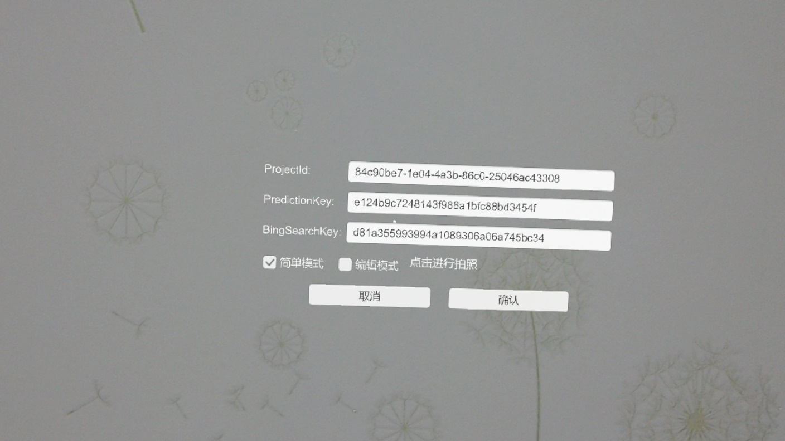  
根据需要修改ProjectId,PredictionKey及BingSearchKey，如果识别场景比较复杂，干扰物体比较多，可以配置使用编辑模式  
这几个值在HoloCustomVision\Assets\Scripts\ConfigurationManager.cs文件中定义  
*简单模式*：拍摄完照片后直接上传图片进行图片分析并显示结果  
*编辑模式*：对拍摄的照片进行简单编辑，选取需要识别的图片部分，上传该部分图片并进行分析
#### 8、配置使用编辑模式后，使用Air Tap点击拍摄照片 ####
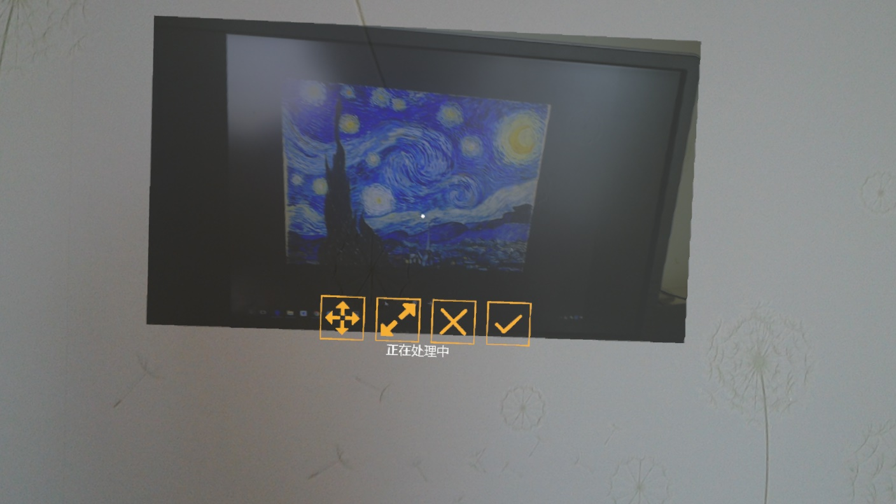  
#### 9、选择功能按钮（移动，缩放，取消，确定），对图片进行简单编辑，选定移动或者缩放按钮后，在原图上将出现裁剪框，目光凝视裁剪框，使用拖拽手势对裁剪框进行平移或者缩放来选择需要识别的图片部分，点击确定按钮上传图片进行分析 ####
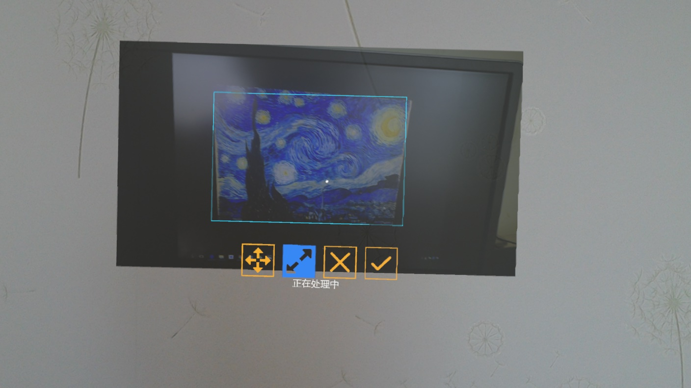  
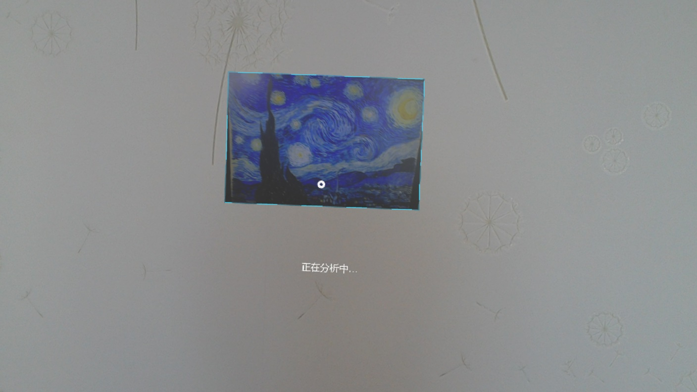  
#### 10、通过使用HoloLens设备Web管理端，直接下载并修改配置文件然后上传 ####
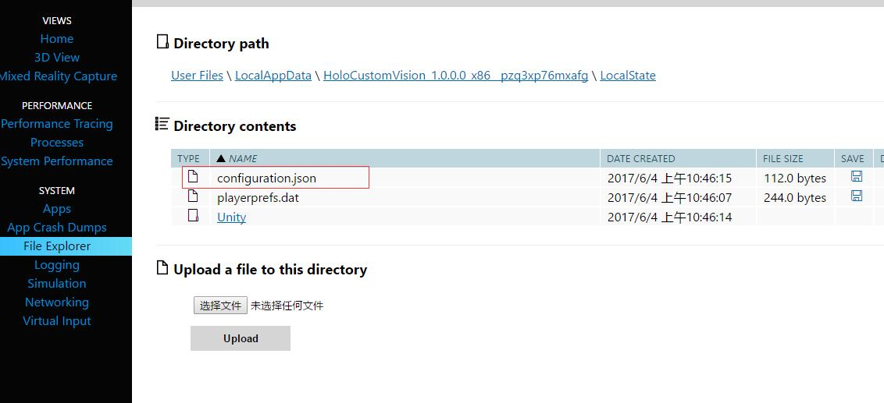  

### 参考 ###
[*Cognitive-CustomVision-Windows*](https://github.com/Microsoft/Cognitive-CustomVision-Windows/)  
[*Custom Vision API*](https://docs.microsoft.com/zh-cn/azure/cognitive-services/custom-vision-service/csharp-tutorial)  
[*Bing Search API*](https://docs.microsoft.com/zh-cn/azure/cognitive-services/bing-image-search/search-the-web)